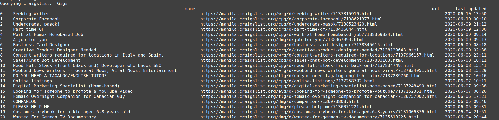
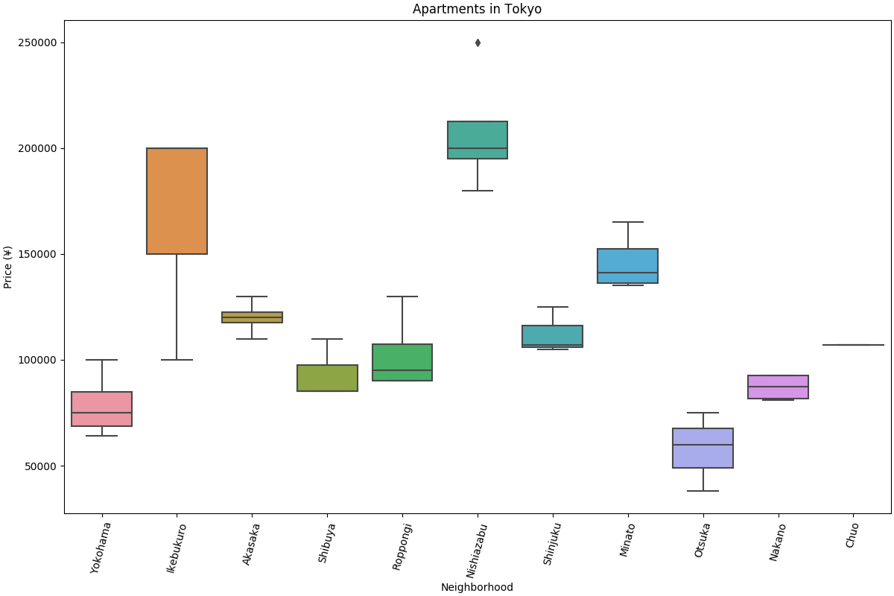

# craigslist-cli
[](https://travis-ci.com/jpdeleon/craigslist)
[](https://github.com/ambv/black)
[](https://www.gnu.org/licenses/gpl-3.0)

scrape data from craigslist via CLI

## examples
* get posts (gigs, jobs, etc) in Manila and print summary on terminal
```bash
./posts.py -g -l manila -v 
```


* get apartments in Tokyo by scraping the first page (-n=1) and show boxplot
```bash
./apartments.py -l tokyo -n 1 -b -v 
```


## See also
* [octoparse](https://www.octoparse.com/tutorial-7/scraping-info-from-craigslist)
